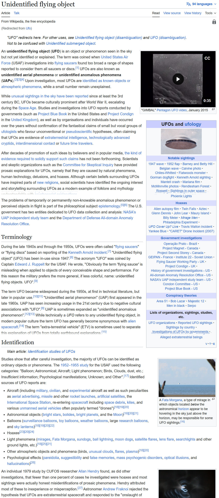
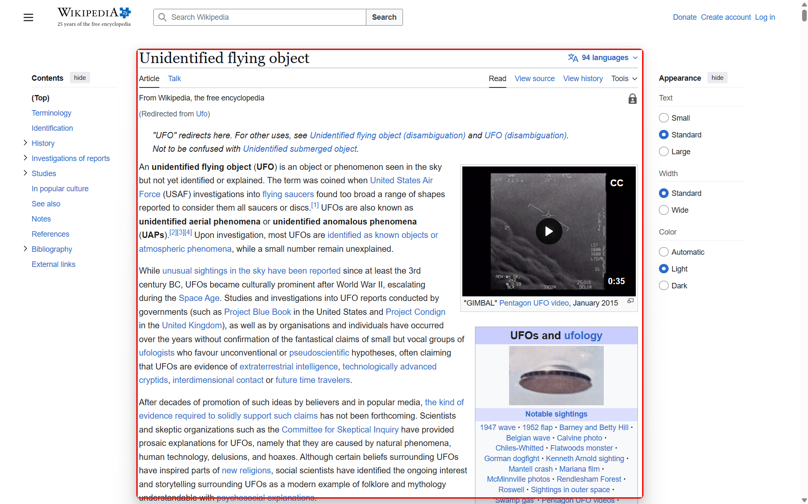

# SnipStitch

SnipStitch is a lightweight Windows app for creating vertical and horizontal scrolling screenshots.

Built for people who want:
- fast capture
- clean stitching
- no subscriptions
- no cloud upload
- no bloated editor nonsense

---

## Screenshot

---

## Features

- Vertical scrolling screenshot stitching
- Horizontal stitching mode
- Live stitched preview
- Seam blending
- Copy stitched image directly to clipboard
- PNG export
- Zoom and fit controls
- Multi-monitor support
- Portable Windows EXE
- Fully local operation
- DPI scaling support for 100%, 125%, 150%, and mixed-monitor setups

---

## Capture Workflow

---

## Download

Download the latest release here:

[Releases](../../releases)

---

## Basic Usage

1. Click **Select Capture Region**
2. Drag around the scrolling content area
3. First snip captures automatically
4. Scroll manually
5. Press **CTRL + SHIFT + S** or click **Capture Snip**
6. Repeat until complete
7. Save PNG or copy to clipboard

---

## Tips

- Leave 15% to 30% overlap between captures
- Avoid browser bars and blank margins
- Use Horizontal Mode for wide scrolling content
- Seam blending helps hide stitch lines

---

## Privacy

SnipStitch runs completely locally.

- No cloud upload
- No telemetry
- No account required
- No accounts
- No subscriptions

---

## Platform

Windows 10 / 11

---

## License Notes

Third-party license notices are included in release packages.

---

## Status

Current Release: v0.3.1

---

## Roadmap

Planned improvements:

- Improved stitch detection
- Optional automatic scrolling
- GIF/video workflow demos
- Installer package
- Auto-update checker
- Additional export options
- UI polish and workflow improvements
